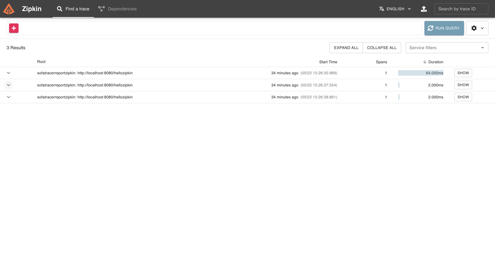
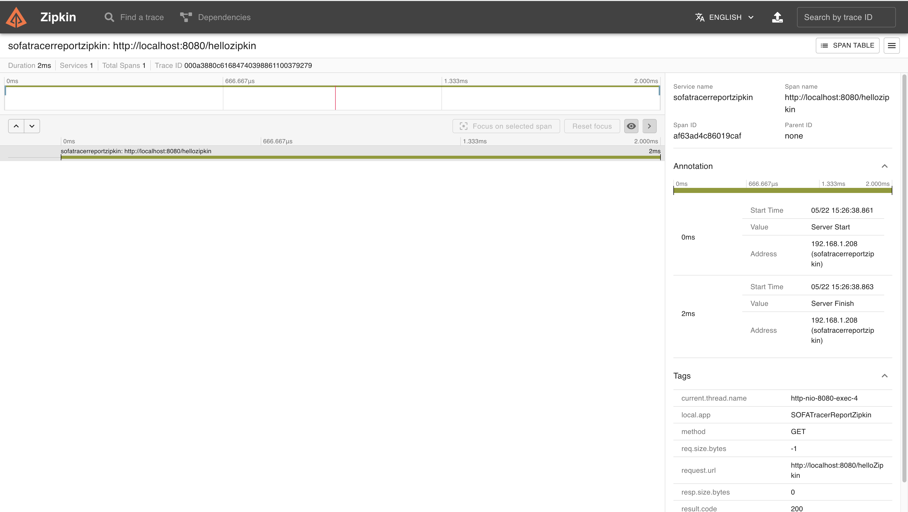

# Overview

This repository provides a simple example of how to generate trace telelemetry information with SOFARPC


## SoftTracer Overview

[SOFATracer](https://www.sofastack.tech/en/projects/sofa-tracer/overview/#:~:text=SOFATracer%20is%20a%20distributed%20link,node%20with%20a%20global%20TraceId%20.) is a distributed link tracing system based on OpenTracing specification developed by Ant Financial. Its core concept is to concatenate the same request distributed on each service node with a global TraceId. By the unified TraceId, it can record the various network call information in the call link in logs, and can remotely report the call records to Zipkin for presentation, thus implementing perspective network call.


SOFATracer is only available from `SOFARPC 5.4.0` -  https://github.com/sofastack/sofa-rpc/releases/tag/v5.4.0


---


## SofaTracer Example

The [repository](https://www.sofastack.tech/en/projects/sofa-tracer/report-to-zipkin) demonstrate a simple example of send trace information to a zipkin endpoint.


## To run
1. Run the application
   - mvn spring-boot:run 
2. Run an instance of zipkin 
   - docker run -d -p 9411:9411 openzipkin/zipkin
3. Generate traces 
   - curl http://localhost:8080/helloZipkin
4. View the trace inform in zipkin UI 
   - http://localhost:9411

## Traces Information
 <br>



---

## Working With Log4j2

### Issue 1 

The log is not showing the `traceId` and `spanId` information. 

### Resolution

The `pom.xml` needs to be carefully configured. Spring boot by default will use its in built logging library. We need to exclude this library and manually add the `log4j2` library

Disable spring logging library

```xml
<dependency>
   <groupId>org.springframework.boot</groupId>
   <artifactId>spring-boot-starter</artifactId>
   <exclusions>
       <exclusion>
           <groupId>org.springframework.boot</groupId>
           <artifactId>spring-boot-starter-logging</artifactId>
       </exclusion>
   </exclusions>
</dependency>
```

Manually add the `log4j2` library

```xml
<dependency>
   <groupId>org.springframework.boot</groupId>
   <artifactId>spring-boot-starter-log4j2</artifactId>
</dependency>
```

Sample log output

```text
2023-06-01 17:00:51.641  INFO [0a3880c61685610051605100184931,0] ---- MDC information
```
---

